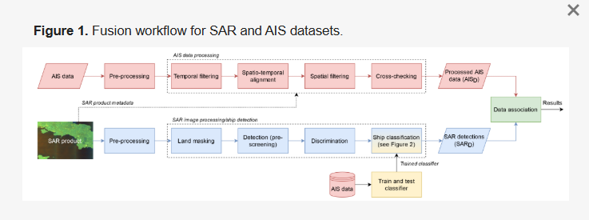

# This file links research papers referenced and cited in this project
---
## Rodger, M.; Guida, R. Classification-Aided SAR and AIS Data Fusion for Space-Based Maritime Surveillance. Remote Sens. 2021, 13, 104.    https://doi.org/10.3390/rs13010104

- Data association between AIS and SAR is predominantly performed using Nearest Neighbor algorithms, although **Global Nearest Neighbor** outperforms both NN and techniques that are based exclusively on spatial transformations as it is demonstrated that the performance of all of these techniques depends primarily on the temporal difference (or ‘gap’) between the sensor acquisitions as well as the ship density.

- Before data association, 2 processes are first performed:
The first addresses the **temporal difference** between the two sensor acquisitions and involves interpolating and/or extrapolating the AIS-reported positions to the time of the SAR image acquisition (also called ‘AIS position projection’). 
The second addresses the phenomenon called **azimuth image shift (or Doppler shift)** *(when an object is moving with a non-zero range velocity component, it will appear displaced in the azimuth direction)* 

- The proposed solution utilises a SAR ship classification model based on AIS transfer learning, which has recently shown to be an effective alternative to conventional SAR ship classification. The returned class information is subsequently used to maximise the confidence in the data association. The data association between SAR and AIS is formulated as an m-best two-dimensional (2D) assignment problem [39,55], which is solved using the Jonker–Volgenant algorithm. This returns not only the best (optimal) AIS-SAR assignments, but also the second, third, and, in general, the mth best assignments. The advantage of this rank-ordered approach means that a robust match between the data can be achieved, where class and static information (i.e., the ship type and dimensions) is used to reduce the ambiguity in the association.

- The fusion workflow is designed to accept input data from various sources as well as SAR imagery products with different imaging modes. The main processes in the workflow include SAR image and AIS data processing, the training of a ship classification model, and data association of the SAR and AIS datasets. The objective of SAR image processing (or ship detection) is to detect objects on the sea surface in the SAR image. The objective of AIS data processing is to prepare AIS data to be matched with the SAR ship detections. The ship classification model uses a transfer learning method to make predictions of the SAR ship detections’ ship type. This information is used in the data association which returns a robust match between the SAR and AIS datasets.

---

